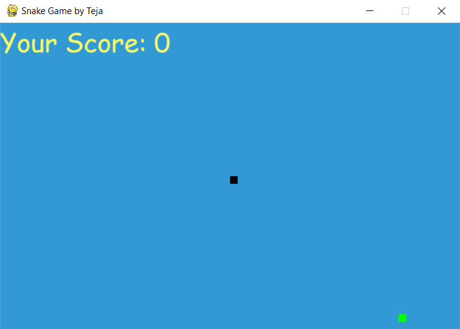

# SnakeGame-Python

Snake game is one of the most popular arcade games of all time. In this game, the main objective of the player is to catch the maximum number of fruits without hitting the wall or itself. Creating a snake game can be taken as a challenge while learning Python or Pygame. It is one of the best beginner-friendly projects that every novice programmer should take as a challenge. Learning to build a video game is kinda interesting and fun learning. 

We will be using Pygame to create this snake game. Pygame is an open-source library that is designed for making video games. It has inbuilt graphics and sounds libraries. It is also beginner-friendly, and cross-platform. 

## Installation
To install Pygame, you need to open up your terminal or command prompt and type the following command:

### pip install pygame
After installing Pygame we are ready to create our cool snake game.

### Step 1: 
Firstly we are importing the necessary libraries.

After that, we are defining the width and height of the window in which the game will be played.
And define the color in RGB format that we are going to use in our game for displaying text.

### Step 2: 
 After importing libraries we need to initialize Pygame using pygame.init() method. 
Create a game window using the width and height defined in the previous step.
Here pygame.time.Clock() will be used further in the main logic of the game to change the speed of the snake.

### Step 3:
Initialize snake position and its size.
After initializing snake position, initialize the fruit position randomly anywhere in the defined height and width.
By setting direction to RIGHT we ensure that, whenever a user runs the program/game, the snake must move right to the screen.

### Step 4: 
Create a function to display the score of the player. 
In this function, firstly we’re creating a font object i.e. the font color will go here.
Then we are using render to create a background surface that we are going to change whenever our score updates.
Create a rectangular object for the text surface object (where text will be refreshed)
Then, we are displaying our score using blit. blit takes two argument screen.blit(background,(x,y))     

### Step 5: 
Now create a game over function that will represent the score after the snake is hit by a wall or itself. 
In the first line, we are creating a font object to display scores.
Then we are creating text surfaces to render scores.
After that, we are setting the position of the text in the middle of the playable area.
Display the scores using blit and updating the score by updating the surface using flip().
We are using sleep(2) to wait for 2 seconds before closing the window using quit().

### Step 6:
Now we will be creating our main function that will do the following things:
We will be validating the keys that will be responsible for the movement of the snake, then we will be creating a special condition that the snake should not be allowed to move in the opposite direction instantaneously.
After that, if snake and fruit collide we will be incrementing the score by 10 and new fruit will be spanned.
After that, we are checking that is the snake hit with a wall or not. If a snake hits a wall we will call game over function.
If the snake hits itself, the game over function will be called.
And in the end, we will be displaying the scores using the show_score function created earlier.

## Sample Picture Of Project

picture of snake Game</img>

